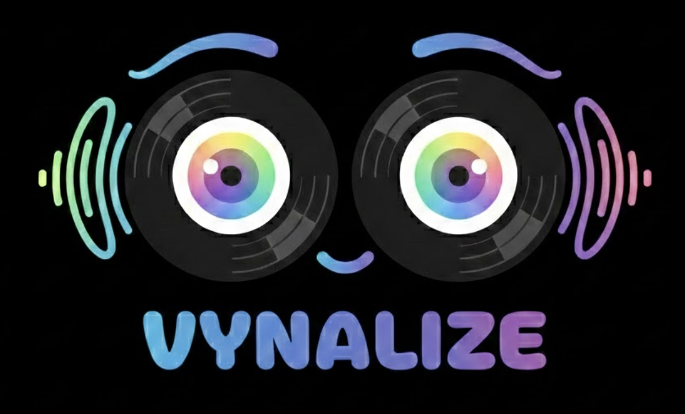

<p align="center">
  
</p>

# Vynalize

A companion display for analog listening. Vynalize passively listens to music from your record player (or any speaker) via the device microphone, identifies what's playing, and provides synchronized visual experiences: audio-reactive visualizations, karaoke-style lyrics, and music videos.

The app never plays music itself -- it's a visual companion for your analog setup.

## Quick Start

### Prerequisites

- Node.js 18+
- [ffmpeg](https://ffmpeg.org/) for audio format conversion:
  ```bash
  # macOS
  brew install ffmpeg

  # Ubuntu/Debian
  sudo apt install ffmpeg

  # Windows (via Chocolatey)
  choco install ffmpeg
  ```

### API Keys (Free)

| Service | Purpose | Get one at |
|---|---|---|
| YouTube Data API v3 | Music video search | https://console.cloud.google.com |

Song identification uses Shazam and requires no API key. The app works as a pure visualizer even without any API keys configured.

### Setup

```bash
git clone https://github.com/oaktech/vynalize.git
cd vynalize

# Install dependencies
npm install

# Configure API keys (option A: .env file)
cp .env.example .env
# Edit .env and add your YouTube API key
# Or configure later via the browser at http://localhost:3001/settings

# Start development servers (frontend + backend)
npm run dev
```

- Frontend: http://localhost:5173
- Backend: http://localhost:3001

## Raspberry Pi Appliance

Vynalize can run as a self-contained appliance on a Raspberry Pi -- no phone, keyboard, or laptop needed after setup. Plug in power, a USB mic, and an HDMI display. It boots straight into the visualizer and starts listening.

### Parts

| Part | Notes |
|---|---|
| Raspberry Pi 5 (4GB+) | Pi 4 works too, but 5 is noticeably smoother |
| USB mic or audio interface | Any class-compliant USB audio input -- e.g. a cheap USB lavalier or a Behringer UCA222 |
| HDMI display | TV, monitor, or portable HDMI screen |
| Micro-SD card (16GB+) | Running Raspberry Pi OS Trixie (64-bit) |
| USB-C power supply | Official Pi 5 PSU recommended (5V/5A) |

### Pi Setup

```bash
git clone https://github.com/oaktech/vynalize.git ~/vynalize
~/vynalize/scripts/pi-setup.sh
sudo reboot
```

The setup script installs everything: Node.js, Chromium kiosk, systemd service, mDNS (`vynalize.local`), and ALSA config for the USB mic.

After reboot, the Pi boots into a full-screen Chromium kiosk at `/kiosk?autostart` and audio capture begins automatically. The phone remote is still available at `http://vynalize.local:3001/remote`.

## How It Works

1. **Listen** -- Grant microphone access and play music from a nearby speaker
2. **Identify** -- The app captures audio snippets and identifies them using Shazam's audio fingerprinting
3. **Visualize** -- Choose from 12 visualization modes, synced karaoke lyrics, ASCII art, or a muted music video
4. **Sync** -- Use tap-to-sync and offset controls to align lyrics and video with your playback

## Display Modes

| Mode | Description |
|---|---|
| Visualizer | 12 audio-reactive visualizations (see below) |
| Lyrics | Karaoke-style synced lyrics from lrclib.net |
| Video | Muted YouTube music video, synced to your playback |
| ASCII | Song title and lyrics rendered as ASCII art |

Switch modes with keyboard shortcuts or the mode selector.

## Visualizers

| # | Name | Description |
|---|---|---|
| 1 | Spectrum Bars | 64-bar frequency spectrum with reflections and beat flash |
| 2 | Radial Spectrum | 128-bar circular display with BPM-driven rotation |
| 3 | Particle Field | 2,000 particles in 3D, driven by bass/mid/high bands |
| 4 | Radical | Neon kaleidoscopic patterns with color-shifting starburst and ring shapes |
| 5 | Nebula | Cosmic eye with animated iris, star field, aurora ribbons, and orbiting particles |
| 6 | Vitals | Hospital ECG monitor with scrolling traces and digital biometric readouts |
| 7 | Synthwave | Retro 80s landscape with perspective grid, mountains, and scan-line sun |
| 8 | Space Age | Four-panel sci-fi diorama: rocket launch, comet, eclipse, and black hole |
| 9 | Starry Night | Van Gogh-inspired scene with swirling brushstrokes, star halos, and cypress tree |
| 10 | Guitar Hero | Simulated rhythm game with 5-lane highway, note gems, combo flames, stage effects, and scoring |
| 11 | Vynalize | Animated logo with reactive eyes, sparkle particles, and beat-driven ripples |
| 12 | Beat Saber | 3D corridor with color-coded blocks, directional arrows, and perspective fog |

All 12 visualizers are lazy-loaded to keep the main bundle small (~34KB gzipped). Hover over a visualizer name in the mode selector to see a short description.

## Beat Detection

Real-time onset detection using spectral flux with BPM estimation from a rolling 30-beat window. Beat events drive visual effects across all visualizers. BPM is displayed in the control overlay.

## Phone Remote & Sessions

Each display generates a unique 6-character session code with a QR code (shown at the top center on `/kiosk`). Scan the QR code or open `/remote` on your phone and enter the code to connect. A controller only affects the display it's paired with -- multiple households can use the same server without interference.

Session codes can be disabled (open mode) via the settings page or by setting `REQUIRE_CODE=false` in `.env`. In open mode, remotes connect without a code -- useful for standalone Pi setups.

The remote supports all controls: display mode, visualizer selection, and sensitivity adjustment. On qualifying browsers, a custom "Add to Home Screen" prompt appears for quick access.

## Architecture

```
vynalize/
├── packages/
│   ├── web/              # React + TypeScript + Vite frontend
│   └── server/           # Express + TypeScript backend
│       └── src/
│           ├── routes/       # HTTP endpoints (identify, search, video, settings, leaderboard)
│           ├── services/     # Redis, Postgres, session manager, cache, identify pool, Shazam, plays, settings
│           ├── middleware/   # Rate limiting, local-only IP restriction
│           ├── workers/      # Worker threads for song identification
│           ├── wsRelay.ts    # Session-based WebSocket relay
│           ├── cluster.ts    # Production multi-process entry point
│           └── index.ts      # Express app entry point
├── hardware/             # 3D-printable enclosure designs (OpenSCAD)
├── scripts/              # Raspberry Pi setup script
└── package.json          # npm workspaces root
```

**Why a backend?** Song identification via Shazam requires server-side ffmpeg + audio processing, and the YouTube Data API key is kept out of the browser. The backend also manages session-based WebSocket routing so multiple users can share a single server without interference.

### External Services

| Service | Purpose | Auth |
|---|---|---|
| Shazam (via node-shazam) | Song identification | None |
| MusicBrainz | Manual search metadata | None (User-Agent only) |
| Cover Art Archive | Album artwork (manual search) | None |
| lrclib.net | Synced lyrics (LRC) | None |
| YouTube Data API | Video search | API key (server-side) |
| YouTube IFrame API | Video embed | None |
| PostgreSQL (optional) | Song play tracking, leaderboard | `DATABASE_URL` env var |
| MaxMind GeoLite2 (via geoip-lite) | Approximate geolocation from IP (bundled, no API calls) | None |
| Redis (optional) | Session sharing, caching, rate limiting | `REDIS_URL` env var |

## Scripts

```bash
npm run dev              # Start both frontend and backend
npm run dev:web          # Frontend only
npm run dev:server       # Backend only
npm run build            # Production build
npm run start:production # Clustered production server (in packages/server)
```

## Keyboard Shortcuts

| Key | Action |
|---|---|
| `F` | Toggle fullscreen |
| `Esc` | Exit fullscreen |
| `1` | Visualizer mode |
| `2` | Lyrics mode |
| `3` | Video mode |
| `4` | ASCII mode |
| `←` / `→` | Adjust sync offset ±0.2s (lyrics/video) |
| `↑` / `↓` | Adjust sync offset ±1s (lyrics/video) |

## Tech Stack

- **Frontend:** React 18, TypeScript, Vite, Tailwind CSS, Zustand, Three.js / React Three Fiber
- **Backend:** Express, TypeScript, node-shazam, ioredis, pg, geoip-lite, helmet, worker_threads
- **Audio:** Web Audio API, AnalyserNode for real-time FFT (2048-point, throttled to ~30fps)

Installable as a PWA with offline support via service worker (auto-updating, precached app shell, runtime-cached fonts and API config).

## License

MIT
